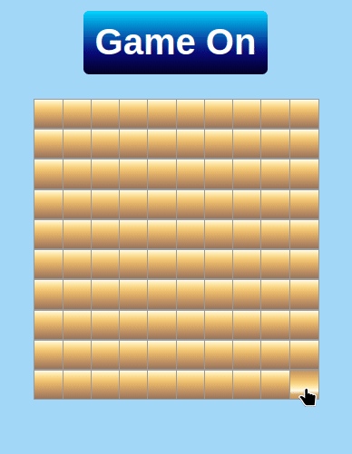

# Minesweeper Clone

This is a Minesweeper clone that was created for fun to demonstrate that John Keen understands the declarative programming paradigm.  The project is a React project and leverages the Vite build tool.  Vitest was used to create testing for each unit of the business logic and the GameBoard. This project may be expanded upon and more testing may be added in the future.


## Getting Started

First you will want to download the project from Github.  The easiest way to run the project is to open the project in VS Code by going to File, Open Folder and then JohnsReactMinesweeper.  Then you go to Terminal and New Terminal.  In the terminal type the following:

```console

npm i
npm run dev

```

Then open up a browser and go to 192.168.1.12:5173. 
An alternative is to remove the following code from vite.config.ts, save and then navigate in the browser to localhost:5173.  

```js

  server: {
    host: '192.168.1.12',
    port: 5173
  },

```

## Game Play


#### Basic

The game is simple.  You start by left clicking a tile.  If the tile is not a mine then the tile will reveal the number of mines in the proximity of the tile clicked.  If there are no mines in the facinity of the tile clicked then tiles are reaveled all the way upto tiles that do have mines around them.  For safety, tiles can be flagged to keep track of potential mines and prevent accidentally clicking a tile that is suspected to be a mine.  If you click on a mine then you lose but if you reveal every tile that is not a mine then you win.  If the number of remaining tiles matches the number of mines then all of the remaining tiles are flagged for the player and none of the tiles can be clicked to prevent the player from making a losing move after the game is won.  The player must start a new game to resume clicking on tiles.

#### Multiclick feature

First a player reveals a tile.  Then a player flags the tiles around the revealed tile that they think are mines.  Then, if the player pushes down both the left mouse button followed by the right mouse button on the revealed tile and releases both buttons over the revealed tile then all tiles that are not flagged are clicked on. This only occurs if the number of flagged neighboring tiles matches the number of the revealed tile.  If the mines are flagged correctly then all of the tiles that are not mines are clicked on and tiles are appropriately revealed.  If the tiles are not flagged correctly then a mine is clicked and the game is lost.

If the player flags the tiles that they suspect are mines and the number of flags matches the number on the revealed tile but the player changes their mind after clicking both left and right mouse down then the player can move the mouse and mouse up outside of the revealed tile.  This will keep the surrounding cells from being clicked on.  The same is true for a single left mouse click.  If a play mouses down on a tile and then changes their mind then all they have to do is move the mouse to outside the tile and mouse up to prevent the click from being completed.

#### Game Demonstration




